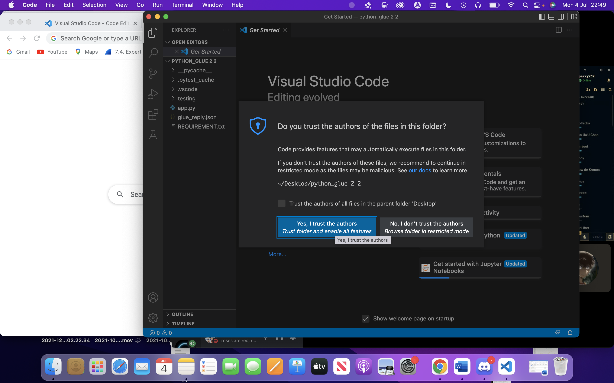
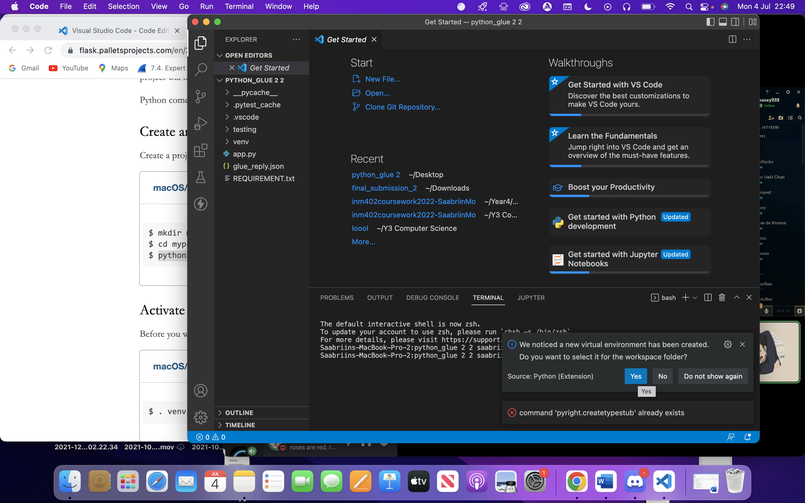

# README
My API is complete! {sorry for the delay}

You would need the following things to run my work:

***DISCLAIMER***

you will need a means to send an API request:

1) Use cURL commands (see in Step 6)
2) Install Visual Studio Code and use Thunder Client (steps are detailed)
3) Install Postman

## Step 1:

***if you want to use visual studio***
Download:

### This is essential to run the code
[Python](https://www.python.org/downloads/) 


***if you want to use visual studio***
[Visual Studio](https://code.visualstudio.com/)
For first-timers, When you open the folder in visual studio, **you will get a "do you trust this file". Click yes I trust the authours**




## Step 2: For both cURL and client method
Once done, you would need to create an environment {as per Flask installation}, so you need to go to terminal and input this:

MacOS/ Linux : python3 -m venv venv

Windows : py -3 -m venv venv

You'll get a pop up on the side saying "We noticed a virtual environment has been created. Do you want to select it for the workspace folder" Click YES



## Step 3:

Activate the environment
```
MacOS: . venv/bin/activate
Windows: venv\Scripts\activate 
```


If you have a pop-up -> Linter pylons is not install -> {install it within the environment}

***If you want to use visual studio follow the following steps below. Else, you can skip this mini step and move on to step 4***
You may want to install some extensions:

1. Python extension
2. Pylance 
3. Thunder client {This can be used to test my api} 

{PS. Some extension may require you to restart visual studio, this is completely fine + no you won't have to redo step 1-3 again }

## Step 4: 

For visual studio terminal you dont have to do this but for the terminal/command prompt, you need to find the file path to where python_glue is stored

For Mac Users: 
cd user/something/folder_where_this_work_is_stored

For window users:
cd user\user\something\python_glue

if you dont know where you put the folder:

Window user:
```
dir python_glue /AD /b /s
```

Mac user:
```
mdfind kind:folder "python_api_comp"
```

type the command 
```
pip install -r requirements.txt
```

in terminal {inside the environment} to install the necessary requirements.

Then run the bash file by typing the following command
```
"./run_flask.sh" -> MacOS + windows
```

I recommend you do this on the terminal or visual studio, use the command line(windows) or terminal(MacOS) !
:sob:
***FOR VISUAL STUDIO***
Potential error: if theres some errors after completing steps 1-4! you havent set up the right interpreter! 
Do this by pressing "command+shift+P" {MacOS} or "control+shift+P" {windowOS}, type "Python: Select interpreter and select "python 3.10.5 ('venv': venv) {if this doesnt show up reload the application and do step 3 if you don't see (venv) when you enter the terminal}

## Step 5: 

How to test the API:
Theres 2 methods of testing this API, cURL and Thunder Client.

cURL method {open another terminal (different to the one running the flask application)}:

Format:
```
cURL -X {POST/GET} http://127.0.0.1:5000/{user/payment} -H Content-Type:application/json -d '{JSON REQUEST}'
```

Example:

GET REQUEST:

```
curl -X GET http://127.0.0.1:5000/user -H Content-Type:application/json -d '{"DoB": "2000-07-31","creditcard": " ","email": "bleh1@gmail.com","password":"coolIsmad2","username":"ever2"}'
```

POST REQUEST:
```
curl -X POST http://127.0.0.1:5000/user -H Content-Type:application/json -d '{"DoB": "2000-07-31","creditcard": " ","email": "bleh1@gmail.com","password":"coolIsmad2","username":"ever2"}'
```

```
curl -X POST http://127.0.0.1:5000/payment -H Content-Type:application/json -d '{"credit_card_number": "5555555555554444", "Amount": "150"}'
```


Thunder Client method:

You go to thunder client {once installed it will show as the thunder bolt sign on the left hand side of visual studio.} and click new request

You'll have a drop-down box that will consist of different operations {such as POST/GET, DELETE PATCH and etc}. As you know, you would only need POST and GET

Where there's "https://www.thunderclient.com/welcome" replace it with "http://127.0.0.1:5000/{user or payment}" 

FOR POST "/USER":

Get the "POST" option with the url " http://127.0.0.1:5000/user"


To input the data, I used a request body, for this you go to body then json and input this:
```
{
    "DoB": "2000-07-31",
    "creditcard": " ",
    "email": "bleh1@gmail.com",
    "password": "coolIsmad2",
    "username": "ever2"
  }
  ```

You can change anything anything inside the content!

Same set up for "/payment" but instead you change the body to:
```
{
    "credit_card_number": "5555555555554444",
    "Amount": "150"
  }
  ```


For GET "/USER" :

Its the same set up as POST /USER but change POST to GET


FOR UNIT TESTING:

you can do CTRL+C to stop the flask application then type:

```
"pytest -v" 
```

or
```
"pytest testing/test_home.py"
```

{inside the environment}

## For More Information:

[Flask Documentation](https://flask.palletsprojects.com/en/2.1.x/installation/)